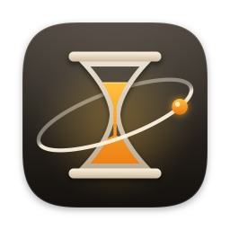
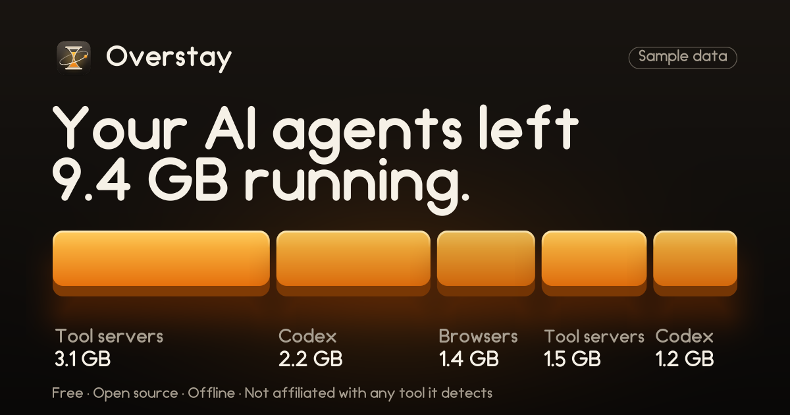

<p align="center"></p>

<h1 align="center">Overstay</h1>

<p align="center"><b>Find and stop the processes your AI coding agents left running.</b><br>
Free, open source, offline. No permissions.</p>

Coding agents start helper processes: tool servers, headless browsers, workers. When a session ends, some of them keep
running, holding memory and a project open. Activity Monitor shows a pile of anonymous `node` rows. Overstay shows
which tool and which project each leftover came from, how much memory it holds and how long ago it started, then stops
the ones you pick, politely.

<p align="center"></p>

> The numbers above are **sample data** from demo mode. Real numbers will replace them once testers have run it.
>
> Which tool started a group is **best-effort until tester dumps confirm it**: expect most groups to read "Agent tool servers" or
> "Headless browsers", with Codex for its known helpers. Cursor, Zed, Windsurf and VS Code are detected as protected hosts
> (never listed, never stopped), not as leftover groups.

**Status: in development.** Nothing here has run on a real Mac yet; the first tester beta comes after CI is green on a
macOS runner and the detection rules have been checked against real process output. See [CHANGELOG.md](CHANGELOG.md).

## Trust box

- **No permissions.** No Full Disk Access, Accessibility, Automation or Screen Recording. It is not sandboxed (a
  sandboxed app cannot see other processes) and needs no entitlement.
- **No network.** Not an update check, not telemetry, not an account. CI rejects the common network APIs.
- **Source you can read.** MIT licensed, no third-party dependencies, and the whole signalling path is one file,
  [`Sources/OverstayMac/Signal.swift`](Sources/OverstayMac/Signal.swift). CI fails if a signal call appears anywhere else.

## What it reads, and what it never does

It reads the process table (process id, parent, start time, owner, memory, executable path), and, **for your own
processes only**, the working folder and the argument list of every one of them, because spotting an agent tool needs
the arguments. Arguments are read in memory, scrubbed of anything that looks like a secret and shown only on your screen (the one exception is **Help › Copy Diagnostics**, which copies a scrubbed summary to your clipboard only when you choose it; read it before posting). Environment values are never
stored, shown or logged: Overstay only checks whether a few well-known variable names are present.

It never reads a file's contents, deletes, moves or edits a file, changes a setting, or touches iCloud. The only things it
writes are its [activity log](#the-activity-log), a share-card image you save yourself, and its preferences (kept by macOS in the app's defaults).

## How it decides

A process is listed only if the first three of these hold, and everything else is ignored:

1. It is yours, not Overstay itself, not one of Overstay's ancestors (the shell, terminal or editor running it), and not
   on the hard-coded protected list (system software, terminals, editors with a live session, `ssh`, `tmux`, Docker and
   VM helpers, databases, language servers and more).
2. It matches a detection rule for a tool server, an agent worker or an automation browser (never your normal Chrome).
3. Its parent is gone (adopted by `launchd`). That alone means nothing; it counts only together with rule 2.
4. No live agent session is using the same project.
5. It started at least 10 minutes ago.
6. Its project is known, it does not listen on a network port, and nothing still writes to its input.

Meeting all six makes it a **Leftover** (called a Ghost in the code and in Copy Diagnostics), pre-selected. Meeting the first three but not the rest, or matching only a
generic pattern, makes it a **Maybe**: shown, never pre-selected, never part of a bulk stop, and stopped one at a time
after its own confirmation. Each row says why in one plain sentence. Overstay cannot know when a session ended, so rows
say "started 3 days ago", never "ended".

The rules are plain data in [`Sources/OverstayCore/Classify`](Sources/OverstayCore/Classify), one line per tool, so adding
one is a small pull request. [docs/BUILD_PLAN.md](docs/BUILD_PLAN.md) has the full contract.

## How it stops things

1. You confirm exactly which processes will be asked to stop. There is **no undo**: anything unsaved inside them is lost.
2. Immediately before each stop, Overstay reads that process again. If its start time, executable, owner or tier changed
   (a reused process id, say), it is left alone and logged.
3. It sends the gentle signal (`SIGTERM`), children before parents, waits up to five seconds, and reports what is still
   running.
4. A stronger signal (`SIGKILL`) is sent only after a separate "Force stop" click on that group, never automatically.

It never signals a process group or a negative process id, and never process 1 or below.

## The activity log

Every target of every stop is appended to `~/Library/Application Support/Overstay/activity.jsonl` (readable only by you):
time, tool, executable name, process id, project **folder name**, memory, result and the "why" line. No argument lists, no
environment, no full paths. A line is written before each signal is sent; if it cannot be written, that signal is not sent.

## Install

Until a Developer ID exists, public builds are unsigned betas, and macOS blocks the first launch:

1. Download `Overstay-<version>.zip` from [Releases](https://github.com/EverydayOpen/overstay/releases) and check it
   against the `Overstay-<version>.zip.sha256` file attached to the same release
   (`shasum -a 256 -c Overstay-<version>.zip.sha256`, run next to the zip).
2. Move **Overstay** to Applications. Right-click it › **Open**, then **Open** again. On macOS 15 and later, open it once,
   then System Settings › Privacy & Security › **Open Anyway**.

Requires macOS 13 or later, Apple silicon or Intel. A Homebrew cask in its own tap is planned. **VERIFY** before
advertising it.

### Build from source

```sh
swift test                                  # Core, Mac and real-system tests (macOS)
brew install xcodegen && xcodegen generate  # writes Overstay.xcodeproj (never committed)
xcodebuild -project Overstay.xcodeproj -scheme Overstay -configuration Release build
```

`OverstayCore` (detection, grouping, planning) is Foundation-only and also builds and tests on Linux:
`bash tools/test_core_docker.sh`.

## Reporting a false positive

Use **Help › Copy Diagnostics** and the [false-positive form](https://github.com/EverydayOpen/overstay/issues/new?template=false-positive.yml).
Diagnostics lists each process that matched a rule with its tier and reason; argument lists are scrubbed and no
environment is included. Read it before posting.

## Contributing

[AGENTS.md](AGENTS.md) has the rules, in particular the safety rules: this app signals processes, so a bug can stop the
wrong thing. `bash tools/safety_greps.sh` and `bash tools/repo_checks.sh` run the mechanical ones locally.

A pull request that adds a detection signature will naturally name the tool. That is fine in the diff. Maintainers squash-merge, and CI checks the commit author and
message on pushes to `main`, not on pull requests, so keep the **PR title** free of tool names, credit lines and trailers:
it becomes the commit message. (Maintainers delete any `Co-authored-by` trailer GitHub adds to the squash message.)

## Not affiliated

Overstay is not affiliated with or endorsed by any of the tools it detects. Their names (for example Claude Code, Codex,
Cursor, Zed, Windsurf, VS Code and Gemini CLI) appear only to say what Overstay looks for; no vendor logos are used.
Apple, Mac and macOS are trademarks of Apple Inc.
